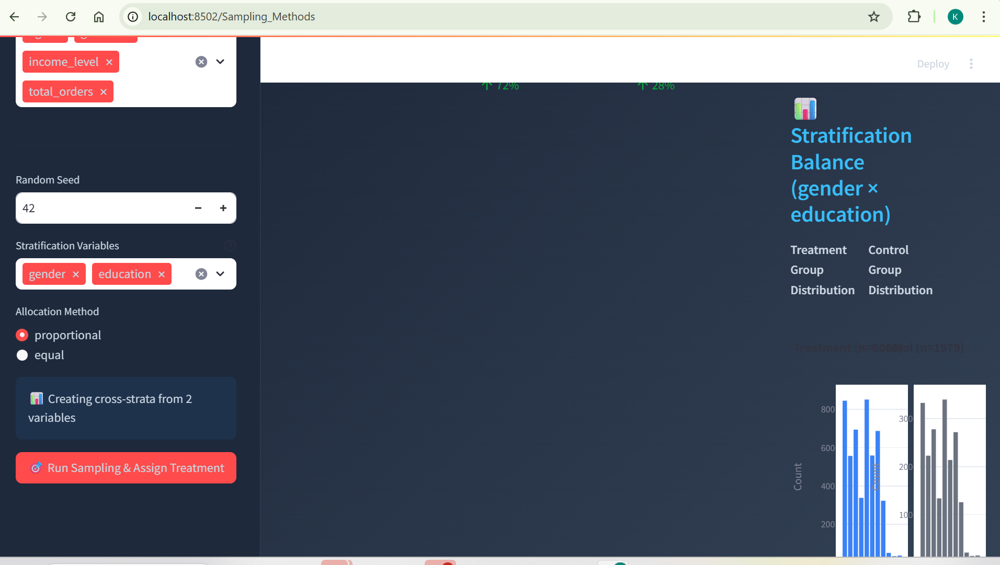
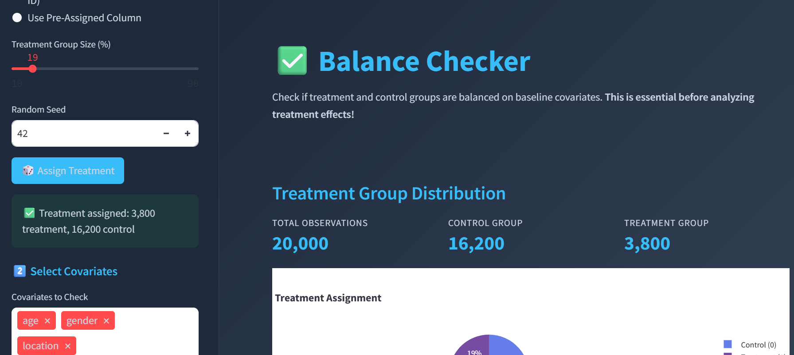
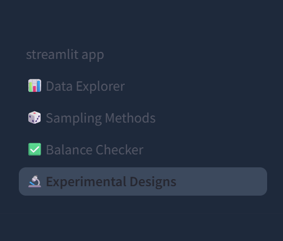

issue 1: page visibility issue: Stratification Balance results are not aligned properly with the website. attached image for you to understand    

issue 2: Post running assignment I was directly expecting to see the balance checker , based on the porevious assignment itshelf , however on the balance checker page you have again asked to assign sample. this is not ideal. attached image for your reference: 

I suggest a different workflow. the moment anyone runs the assignment, balance checker should be auto triggered with default selctions and autometically move to balance checker page . Again random assignment is not required , rather use the previous assignment done on sampling method page. 

issue 3: you have a check box for "perform statistical test" , result of these statistical tests should be displayed along with summary on the balance checker page. 

issue 4: on the experiment design page , Blocking variable should be multi select 

issue 5: on the experiment design page , each technical term needs to have explasion , add tool tips for new user to understand the concept and why behind them.

issue 6: on RBD design also should have an option to custom allocation of sample size. 

issue 7: on experiment design page you need to have an option to export sample assignment based on the experiment design as well. 

issue 8: design type should have partial factorial design option as well , this is very important and practically used for multivariate analysis .

issue 9: some texts on the the left side panel is not visible  

